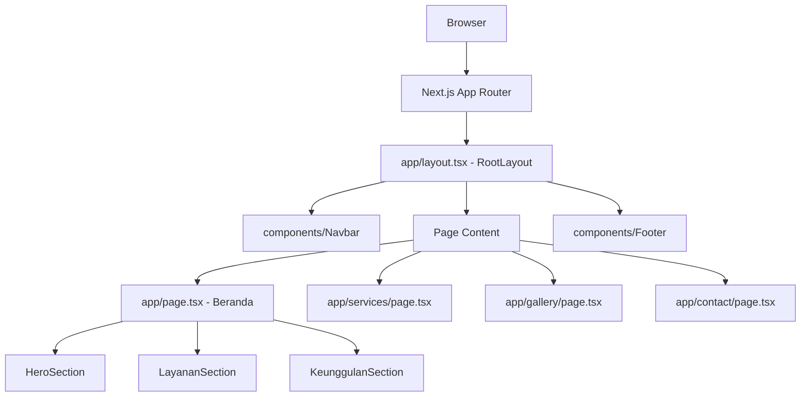

# Design Document

## Overview

BesiKita V1 adalah website pemasaran statis untuk bisnis jasa olah besi. Tujuan utama V1 adalah membangun fondasi teknis yang solid dan menyajikan landing page yang informatif kepada calon pelanggan.

Stack yang digunakan:
- **Next.js 14** dengan App Router
- **TypeScript** sebagai bahasa utama
- **Tailwind CSS** untuk styling
- **Vercel** sebagai platform deployment

Pendekatan desain mengutamakan kesederhanaan: semua halaman di-render sebagai Server Components secara default, tidak ada state management eksternal, dan tidak ada data fetching dari API eksternal pada V1.

---

## Architecture



Semua komponen adalah React Server Components kecuali ada kebutuhan interaktivitas client-side. Routing sepenuhnya ditangani oleh Next.js App Router dengan `next/link` untuk navigasi client-side tanpa full page reload.

---

## Components and Interfaces

### Struktur Folder

```
/
├── app/
│   ├── layout.tsx          # RootLayout
│   ├── page.tsx            # Halaman Beranda
│   ├── services/
│   │   └── page.tsx        # Placeholder /services
│   ├── gallery/
│   │   └── page.tsx        # Placeholder /gallery
│   └── contact/
│       └── page.tsx        # Placeholder /contact
├── components/
│   ├── Navbar.tsx
│   ├── Footer.tsx
│   ├── HeroSection.tsx
│   ├── LayananSection.tsx
│   ├── ServiceCard.tsx
│   └── KeunggulanSection.tsx
├── public/
├── types/
│   └── index.ts
└── utils/
```

### Komponen

**Navbar**
- Menampilkan logo/nama "BesiKita" dan 4 item navigasi
- Setiap item menggunakan `next/link`
- Props: tidak ada (data navigasi hardcoded)

```typescript
// Tidak ada props eksternal
export default function Navbar(): JSX.Element
```

**Footer**
- Menampilkan copyright dan informasi kontak
- Props: tidak ada

```typescript
export default function Footer(): JSX.Element
```

**RootLayout** (`app/layout.tsx`)
- Membungkus semua halaman dengan `<Navbar />` dan `<Footer />`
- Mendefinisikan metadata SEO global
- Mengatur font dan warna dasar via Tailwind

**HeroSection**
- Judul, subjudul, dan tombol CTA yang mengarah ke `/services`
- Props: tidak ada (konten hardcoded untuk V1)

**ServiceCard**
- Kartu individual untuk satu layanan
- Props:

```typescript
interface ServiceCardProps {
  title: string;
  description: string;
  icon: string; // placeholder emoji atau karakter
}
```

**LayananSection**
- Menampilkan 3 `ServiceCard` dalam grid
- Data layanan didefinisikan secara lokal di komponen

**KeunggulanSection**
- Menampilkan 3 kolom keunggulan dalam grid
- Data keunggulan didefinisikan secara lokal di komponen

---

## Data Models

Karena V1 tidak menggunakan database atau API eksternal, semua data bersifat statis dan didefinisikan langsung di dalam komponen atau sebagai konstanta.

```typescript
// types/index.ts

export interface ServiceItem {
  id: string;
  title: string;
  description: string;
  icon: string;
}

export interface AdvantageItem {
  id: string;
  title: string;
  description: string;
}
```

Data layanan (digunakan di `LayananSection`):

```typescript
const services: ServiceItem[] = [
  {
    id: "kursi-besi",
    title: "Kursi Besi",
    description: "Kursi besi custom untuk kebutuhan indoor maupun outdoor.",
    icon: "🪑",
  },
  {
    id: "pagar-besi",
    title: "Pagar Besi",
    description: "Pagar besi kokoh dengan desain sesuai kebutuhan Anda.",
    icon: "🔩",
  },
  {
    id: "kanopi",
    title: "Kanopi",
    description: "Kanopi besi tahan cuaca untuk carport dan teras rumah.",
    icon: "🏠",
  },
];
```

Data keunggulan (digunakan di `KeunggulanSection`):

```typescript
const advantages: AdvantageItem[] = [
  {
    id: "bahan-berkualitas",
    title: "Bahan Berkualitas",
    description: "Menggunakan besi pilihan berstandar SNI untuk ketahanan jangka panjang.",
  },
  {
    id: "harga-bersaing",
    title: "Harga Bersaing",
    description: "Harga transparan dan kompetitif tanpa biaya tersembunyi.",
  },
  {
    id: "tepat-waktu",
    title: "Pengerjaan Tepat Waktu",
    description: "Komitmen penyelesaian sesuai jadwal yang disepakati.",
  },
];
```

---

## Correctness Properties

*A property is a characteristic or behavior that should hold true across all valid executions of a system — essentially, a formal statement about what the system should do. Properties serve as the bridge between human-readable specifications and machine-verifiable correctness guarantees.*

### Property 1: Setiap item navigasi Navbar memiliki href yang benar

*For any* item navigasi yang dirender oleh komponen Navbar, href dari elemen link tersebut harus sesuai dengan rute yang ditentukan: Beranda → `/`, Layanan → `/services`, Galeri → `/gallery`, Kontak → `/contact`.

**Validates: Requirements 2.2, 2.4, 2.5, 2.6, 2.7**

### Property 2: Section Layanan Kami merender tepat 3 ServiceCard

*For any* render dari komponen `LayananSection`, jumlah `ServiceCard` yang dirender harus selalu tepat 3, tidak lebih dan tidak kurang.

**Validates: Requirements 6.1**

### Property 3: Setiap ServiceCard memiliki tombol Detail yang mengarah ke /services

*For any* `ServiceCard` yang dirender di dalam `LayananSection`, elemen tombol atau link "Detail" harus memiliki href `/services`.

**Validates: Requirements 6.5**

### Property 4: Setiap item keunggulan dirender dengan judul dan deskripsi

*For any* item dalam data keunggulan yang diberikan ke `KeunggulanSection`, output render harus mengandung teks judul dan teks deskripsi dari item tersebut.

**Validates: Requirements 7.2**

---

## Error Handling

Karena V1 adalah website statis tanpa API calls atau user input yang kompleks, skenario error yang perlu ditangani terbatas:

1. **Rute tidak ditemukan**: Next.js App Router secara otomatis menampilkan halaman 404 bawaan untuk rute yang tidak terdefinisi. Tidak diperlukan penanganan khusus (Requirement 8.6).

2. **Build error**: Jika ada error TypeScript atau ESLint saat build, Vercel akan menolak deployment. Ini adalah mekanisme perlindungan yang diinginkan.

3. **Komponen gagal render**: Karena semua data bersifat statis dan hardcoded, tidak ada skenario runtime error yang diharapkan. Jika terjadi, Next.js akan menampilkan error boundary bawaan di development mode.

---

## Testing Strategy

### Pendekatan Dual Testing

Testing V1 menggunakan dua pendekatan yang saling melengkapi:

1. **Unit/Example Tests** — memverifikasi konten spesifik dan struktur komponen
2. **Property-Based Tests** — memverifikasi invariant yang berlaku untuk semua input

### Library yang Digunakan

- **Testing framework**: [Vitest](https://vitest.dev/) (kompatibel dengan Next.js, lebih cepat dari Jest)
- **React testing**: [@testing-library/react](https://testing-library.com/docs/react-testing-library/intro/)
- **Property-based testing**: [fast-check](https://fast-check.io/) (library PBT untuk TypeScript/JavaScript)

### Unit Tests (Example-Based)

Fokus pada verifikasi konten spesifik yang hardcoded:

| Test | Komponen | Requirement |
|------|----------|-------------|
| Navbar merender 4 item menu | Navbar | 2.1 |
| Footer menampilkan copyright BesiKita | Footer | 3.1 |
| Footer menampilkan email dan telepon | Footer | 3.2 |
| RootLayout merender Navbar sebelum children | RootLayout | 4.1 |
| RootLayout merender Footer setelah children | RootLayout | 4.1 |
| Metadata mengandung title dan description | RootLayout | 4.2 |
| HeroSection menampilkan judul utama | HeroSection | 5.1 |
| HeroSection menampilkan subjudul | HeroSection | 5.2 |
| HeroSection menampilkan tombol CTA | HeroSection | 5.3 |
| Tombol CTA mengarah ke /services | HeroSection | 5.4 |
| LayananSection menampilkan Kursi Besi | LayananSection | 6.2 |
| LayananSection menampilkan Pagar Besi | LayananSection | 6.3 |
| LayananSection menampilkan Kanopi | LayananSection | 6.4 |
| KeunggulanSection menampilkan 3 judul keunggulan | KeunggulanSection | 7.1 |
| Halaman /services dapat dirender tanpa error | app/services/page | 8.2 |
| Halaman /gallery dapat dirender tanpa error | app/gallery/page | 8.3 |
| Halaman /contact dapat dirender tanpa error | app/contact/page | 8.4 |

### Property-Based Tests

Setiap property test harus dijalankan minimum **100 iterasi** menggunakan fast-check.

Setiap test diberi tag komentar dengan format:
`// Feature: besikita-v1-fondasi-landing, Property {N}: {deskripsi singkat}`

**Property 1 — Navbar href invariant**
```typescript
// Feature: besikita-v1-fondasi-landing, Property 1: Setiap item navigasi Navbar memiliki href yang benar
// Untuk setiap kombinasi item navigasi yang valid, href harus sesuai dengan mapping yang ditentukan
fc.assert(
  fc.property(fc.constantFrom(...navItems), (item) => {
    const { getByText } = render(<Navbar />);
    const link = getByText(item.label).closest('a');
    expect(link).toHaveAttribute('href', item.expectedHref);
  }),
  { numRuns: 100 }
);
```

**Property 2 — LayananSection selalu 3 kartu**
```typescript
// Feature: besikita-v1-fondasi-landing, Property 2: Section Layanan Kami merender tepat 3 ServiceCard
fc.assert(
  fc.property(fc.constant(null), () => {
    const { getAllByRole } = render(<LayananSection />);
    const cards = getAllByRole('article'); // atau selector yang sesuai
    expect(cards).toHaveLength(3);
  }),
  { numRuns: 100 }
);
```

**Property 3 — Setiap ServiceCard href /services**
```typescript
// Feature: besikita-v1-fondasi-landing, Property 3: Setiap ServiceCard memiliki tombol Detail yang mengarah ke /services
fc.assert(
  fc.property(fc.constantFrom(...serviceItems), (service) => {
    const { getByText } = render(<ServiceCard {...service} />);
    const detailLink = getByText('Detail').closest('a');
    expect(detailLink).toHaveAttribute('href', '/services');
  }),
  { numRuns: 100 }
);
```

**Property 4 — KeunggulanSection render judul dan deskripsi**
```typescript
// Feature: besikita-v1-fondasi-landing, Property 4: Setiap item keunggulan dirender dengan judul dan deskripsi
fc.assert(
  fc.property(fc.constantFrom(...advantageItems), (item) => {
    const { getByText } = render(<KeunggulanSection />);
    expect(getByText(item.title)).toBeInTheDocument();
    expect(getByText(item.description)).toBeInTheDocument();
  }),
  { numRuns: 100 }
);
```

### Catatan Implementasi Testing

- Unit tests dan property tests berjalan bersama dengan `vitest --run`
- Tidak ada watch mode di CI/CD
- Coverage target: semua komponen utama tercakup minimal oleh satu test
- Property tests menggunakan `fc.constantFrom` karena data bersifat statis — ini tetap valid sebagai property test karena memverifikasi invariant berlaku untuk setiap elemen data
