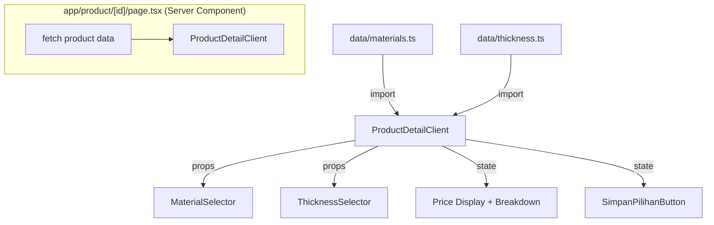

# Design Document

## BesiKita V3 — Bahan Besi & Kustomisasi

## Overview

V3 memperluas halaman detail produk (`/product/[id]`) dengan menambahkan sistem kustomisasi bahan besi. Visitor dapat memilih jenis bahan (Material) dan ketebalan (ThicknessOption), lalu melihat harga total berubah secara realtime tanpa reload halaman.

Fitur ini bersifat **stateful di sisi klien** — tidak ada API call, tidak ada keranjang belanja, tidak ada persistensi ke server. Semua kalkulasi terjadi di browser menggunakan React state.

Karena halaman detail saat ini adalah Server Component, perlu direfactor menjadi Client Component (atau menggunakan wrapper Client Component) agar dapat menggunakan `useState`.

## Architecture



### Pola Refactor: Server + Client Wrapper

Halaman `/product/[id]/page.tsx` tetap sebagai Server Component untuk fetch data produk. Data produk kemudian diteruskan ke `ProductDetailClient` — sebuah Client Component baru yang mengelola semua state kustomisasi.

```
app/product/[id]/
  page.tsx              ← Server Component (fetch product, pass to client)
  ProductDetailClient.tsx ← Client Component ("use client", semua state di sini)
```

Alternatif: menjadikan `page.tsx` langsung sebagai Client Component. Namun pola Server+Client lebih idiomatis di Next.js 14 App Router dan mempertahankan kemampuan SSR untuk data produk.

## Components and Interfaces

### `data/materials.ts`

```typescript
export interface Material {
  id: string;
  nama: string;
  hargaTambahanPerUnit: number;
  satuan: string;
}

export const materials: Material[] = [...]
```

### `data/thickness.ts`

```typescript
export interface ThicknessOption {
  id: string;
  label: string;
  hargaTambahan: number;
}

export const thicknessOptions: ThicknessOption[] = [...]
```

### `components/MaterialSelector.tsx`

Client Component. Menampilkan daftar material sebagai tombol pilihan (radio-style).

```typescript
interface MaterialSelectorProps {
  selectedMaterial: Material;
  onMaterialChange: (material: Material) => void;
}
```

Setiap tombol menampilkan `nama` dan `hargaTambahanPerUnit` (diformat ke Rupiah). Tombol yang aktif mendapat styling berbeda (border/background highlight).

### `components/ThicknessSelector.tsx`

Client Component. Menampilkan daftar ketebalan sebagai tombol pilihan (radio-style).

```typescript
interface ThicknessSelectorProps {
  selectedThickness: ThicknessOption;
  onThicknessChange: (thickness: ThicknessOption) => void;
}
```

Setiap tombol menampilkan `label` dan `hargaTambahan` (diformat ke Rupiah, "Gratis" jika 0). Tombol yang aktif mendapat styling berbeda.

### `ProductDetailClient.tsx` (Client Component baru)

Mengelola state `selectedMaterial` dan `selectedThickness`, menghitung `hargaTotal`, dan merender semua komponen kustomisasi.

```typescript
interface ProductDetailClientProps {
  product: Product;
}
```

State:
- `selectedMaterial: Material` — default `materials[0]`
- `selectedThickness: ThicknessOption` — default `thicknessOptions[0]`
- `savedSelection: { material: Material; thickness: ThicknessOption } | null`

Kalkulasi:
```typescript
const hargaTotal = product.hargaDasar
  + selectedMaterial.hargaTambahanPerUnit
  + selectedThickness.hargaTambahan;
```

### `SimpanPilihanButton` (inline atau komponen terpisah)

Menggantikan `PesanJasaButton`. Saat diklik, menyimpan pilihan ke state lokal dan menampilkan `alert("Pilihan disimpan sementara")`.

## Data Models

### Material

| Field | Type | Keterangan |
|---|---|---|
| `id` | `string` | Identifier unik, e.g. `"hollow-hitam"` |
| `nama` | `string` | Nama tampilan, e.g. `"Hollow Hitam"` |
| `hargaTambahanPerUnit` | `number` | Tambahan harga dalam Rupiah |
| `satuan` | `string` | Satuan harga, e.g. `"per unit"` |

Data:
| id | nama | hargaTambahanPerUnit | satuan |
|---|---|---|---|
| `hollow-hitam` | Hollow Hitam | 50000 | per unit |
| `hollow-galvanis` | Hollow Galvanis | 75000 | per unit |
| `siku-besi` | Siku Besi | 40000 | per unit |

### ThicknessOption

| Field | Type | Keterangan |
|---|---|---|
| `id` | `string` | Identifier unik, e.g. `"1-2mm"` |
| `label` | `string` | Label tampilan, e.g. `"1.2mm"` |
| `hargaTambahan` | `number` | Tambahan harga dalam Rupiah |

Data:
| id | label | hargaTambahan |
|---|---|---|
| `1-2mm` | 1.2mm | 0 |
| `1-5mm` | 1.5mm | 25000 |
| `2-0mm` | 2.0mm | 50000 |

### Kalkulasi Harga Total

```
hargaTotal = product.hargaDasar
           + selectedMaterial.hargaTambahanPerUnit
           + selectedThickness.hargaTambahan
```

### Price Breakdown (tampilan)

```
Harga dasar:   Rp [hargaDasar]
+ Bahan:       Rp [hargaTambahanPerUnit]
+ Ketebalan:   Rp [hargaTambahan]
─────────────────────────────
Total:         Rp [hargaTotal]
```

Format angka menggunakan `toLocaleString("id-ID")`.


## Correctness Properties

*A property is a characteristic or behavior that should hold true across all valid executions of a system — essentially, a formal statement about what the system should do. Properties serve as the bridge between human-readable specifications and machine-verifiable correctness guarantees.*

### Property 1: Integritas Struktur Data

*For any* elemen dalam array `materials` maupun `thicknessOptions`, setiap elemen harus memiliki semua field yang diperlukan dengan tipe yang benar: `Material` memiliki `id` (string), `nama` (string), `hargaTambahanPerUnit` (number), `satuan` (string); `ThicknessOption` memiliki `id` (string), `label` (string), `hargaTambahan` (number).

**Validates: Requirements 1.1, 2.1**

### Property 2: Keunikan ID

*For any* pasangan elemen dalam array `materials`, kedua elemen tidak boleh memiliki `id` yang sama. Hal yang sama berlaku untuk semua pasangan elemen dalam array `thicknessOptions`.

**Validates: Requirements 1.6, 2.6**

### Property 3: MaterialSelector Merender Semua Material dengan Konten Benar

*For any* array materials yang diberikan, `MaterialSelector` harus merender tepat sebanyak elemen array tersebut sebagai pilihan, dan setiap pilihan harus mengandung `nama` dan nilai `hargaTambahanPerUnit` dari material yang bersangkutan.

**Validates: Requirements 3.2, 3.4**

### Property 4: MaterialSelector Callback Dipanggil dengan Argumen yang Benar

*For any* material dalam daftar pilihan, ketika pengguna mengklik pilihan tersebut, `onMaterialChange` harus dipanggil tepat satu kali dengan objek material yang diklik sebagai argumen.

**Validates: Requirements 3.3**

### Property 5: MaterialSelector Menandai Pilihan Aktif

*For any* nilai `selectedMaterial` yang diberikan ke `MaterialSelector`, hanya elemen yang sesuai dengan `selectedMaterial.id` yang harus memiliki indikator aktif (aria-pressed, class highlight, atau atribut selected).

**Validates: Requirements 3.5**

### Property 6: ThicknessSelector Merender Semua Opsi dengan Konten Benar

*For any* array thicknessOptions yang diberikan, `ThicknessSelector` harus merender tepat sebanyak elemen array tersebut sebagai pilihan, dan setiap pilihan harus mengandung `label` dan nilai `hargaTambahan` dari opsi yang bersangkutan.

**Validates: Requirements 4.2, 4.4**

### Property 7: ThicknessSelector Callback Dipanggil dengan Argumen yang Benar

*For any* thickness option dalam daftar pilihan, ketika pengguna mengklik pilihan tersebut, `onThicknessChange` harus dipanggil tepat satu kali dengan objek ThicknessOption yang diklik sebagai argumen.

**Validates: Requirements 4.3**

### Property 8: ThicknessSelector Menandai Pilihan Aktif

*For any* nilai `selectedThickness` yang diberikan ke `ThicknessSelector`, hanya elemen yang sesuai dengan `selectedThickness.id` yang harus memiliki indikator aktif.

**Validates: Requirements 4.5**

### Property 9: Kalkulasi Harga Total

*For any* kombinasi `hargaDasar` (number ≥ 0), `hargaTambahanPerUnit` (number ≥ 0), dan `hargaTambahan` (number ≥ 0), nilai `hargaTotal` yang dihitung harus sama persis dengan `hargaDasar + hargaTambahanPerUnit + hargaTambahan`.

**Validates: Requirements 6.1**

### Property 10: Price Breakdown Merender Semua Komponen Harga

*For any* kombinasi produk, material, dan thickness yang valid, output rendering Price Breakdown harus mengandung tiga baris: string yang memuat nilai `hargaDasar`, string yang memuat nilai `hargaTambahanPerUnit`, dan string yang memuat nilai `hargaTambahan`.

**Validates: Requirements 6.3**

### Property 11: Format Mata Uang Indonesia

*For any* angka harga (number ≥ 0), hasil format menggunakan locale `"id-ID"` harus menggunakan titik (`.`) sebagai pemisah ribuan dan tidak menggunakan koma sebagai pemisah desimal untuk bilangan bulat.

**Validates: Requirements 6.4**

### Property 12: Simpan Pilihan Memperbarui State

*For any* kombinasi `selectedMaterial` dan `selectedThickness` yang valid, setelah tombol "Simpan Pilihan" diklik, state `savedSelection` harus berisi objek dengan `material` yang sama dengan `selectedMaterial` dan `thickness` yang sama dengan `selectedThickness`.

**Validates: Requirements 7.2**

## Error Handling

### Data Tidak Ditemukan

Jika `products.find()` tidak menemukan produk dengan `id` yang diberikan, halaman menampilkan pesan error dengan link kembali ke `/services`. Ini sudah ada dari V2 dan tidak berubah.

### Array Data Kosong

`materials` dan `thicknessOptions` adalah data statis yang selalu berisi 3 elemen. Tidak ada mekanisme error khusus yang diperlukan. Namun, komponen selector harus tetap merender dengan benar jika array kosong (tidak crash).

### Nilai Harga Negatif

Data statis tidak mengandung nilai negatif. Kalkulasi harga tidak perlu validasi khusus karena semua nilai sudah terdefinisi di data file.

### State Initialization

`selectedMaterial` dan `selectedThickness` diinisialisasi dengan `materials[0]` dan `thicknessOptions[0]`. Karena array selalu memiliki minimal 1 elemen (data statis), tidak ada risiko `undefined`.

## Testing Strategy

### Pendekatan Dual Testing

Fitur ini menggunakan dua lapisan pengujian yang saling melengkapi:

1. **Unit tests** — untuk contoh spesifik, nilai data konkret, dan integrasi komponen
2. **Property-based tests** — untuk memverifikasi properti universal di semua kombinasi input

### Library

- **Unit & Property tests**: Vitest (sudah terkonfigurasi di proyek)
- **Property-based testing**: `fast-check` v3 (sudah ada di `devDependencies`)
- **Component testing**: `@testing-library/react` (sudah ada di `devDependencies`)

### Unit Tests

Fokus pada contoh konkret dan nilai data spesifik:

- `materials` berisi tepat 3 elemen (Req 1.2)
- `materials` mengandung "Hollow Hitam" dengan `hargaTambahanPerUnit` 50000 (Req 1.3)
- `materials` mengandung "Hollow Galvanis" dengan `hargaTambahanPerUnit` 75000 (Req 1.4)
- `materials` mengandung "Siku Besi" dengan `hargaTambahanPerUnit` 40000 (Req 1.5)
- `thicknessOptions` berisi tepat 3 elemen (Req 2.2)
- `thicknessOptions` mengandung "1.2mm" dengan `hargaTambahan` 0 (Req 2.3)
- `thicknessOptions` mengandung "1.5mm" dengan `hargaTambahan` 25000 (Req 2.4)
- `thicknessOptions` mengandung "2.0mm" dengan `hargaTambahan` 50000 (Req 2.5)
- Halaman detail menginisialisasi `selectedMaterial` dengan `materials[0]` (Req 5.3)
- Halaman detail menginisialisasi `selectedThickness` dengan `thicknessOptions[0]` (Req 5.4)
- Tombol "Simpan Pilihan" ada di halaman detail (Req 7.1)
- Klik "Simpan Pilihan" menampilkan alert "Pilihan disimpan sementara" (Req 7.3)

### Property-Based Tests

Setiap property test harus berjalan minimum **100 iterasi**. Setiap test diberi tag komentar dengan format:

```
// Feature: besikita-v3-bahan-kustomisasi, Property {N}: {property_text}
```

| Property | Deskripsi | Pattern |
|---|---|---|
| P1 | Integritas struktur data | Invariant |
| P2 | Keunikan ID | Invariant |
| P3 | MaterialSelector renders all materials | Invariant |
| P4 | MaterialSelector callback correctness | Round-trip / Event |
| P5 | MaterialSelector active state | Invariant |
| P6 | ThicknessSelector renders all options | Invariant |
| P7 | ThicknessSelector callback correctness | Round-trip / Event |
| P8 | ThicknessSelector active state | Invariant |
| P9 | Kalkulasi harga total | Metamorphic |
| P10 | Price breakdown rendering | Invariant |
| P11 | Format mata uang Indonesia | Invariant |
| P12 | Simpan pilihan memperbarui state | Round-trip |

Contoh implementasi Property 9 dengan fast-check:

```typescript
// Feature: besikita-v3-bahan-kustomisasi, Property 9: Kalkulasi Harga Total
it("hargaTotal selalu = hargaDasar + hargaTambahanPerUnit + hargaTambahan", () => {
  fc.assert(
    fc.property(
      fc.integer({ min: 0, max: 10_000_000 }),
      fc.integer({ min: 0, max: 500_000 }),
      fc.integer({ min: 0, max: 500_000 }),
      (hargaDasar, hargaTambahanPerUnit, hargaTambahan) => {
        const result = hargaDasar + hargaTambahanPerUnit + hargaTambahan;
        expect(result).toBe(hargaDasar + hargaTambahanPerUnit + hargaTambahan);
      }
    ),
    { numRuns: 100 }
  );
});
```
