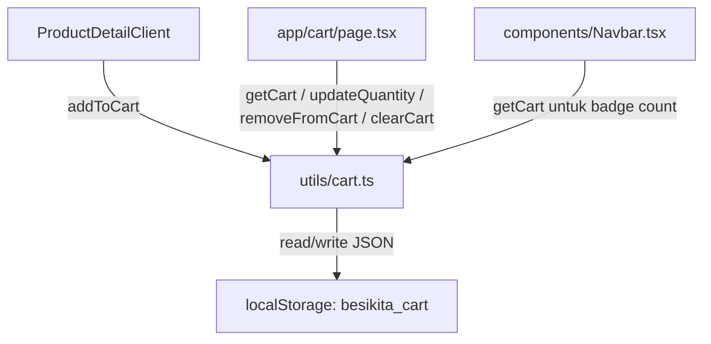

# Design Document

## BesiKita V4 — Halaman Pesanan (Keranjang) & Kalkulasi Total

## Overview

V4 menambahkan sistem keranjang belanja (cart) di atas fondasi V3. Fitur ini memungkinkan user mengumpulkan beberapa produk beserta pilihan bahan dan ketebalannya, mengatur kuantitas, menghapus item, dan melihat total harga sebelum melanjutkan ke pemesanan.

Arsitektur utama:
- **`utils/cart.ts`** — semua logika cart (tipe data + fungsi CRUD) dengan `localStorage` sebagai persistence layer
- **`app/cart/page.tsx`** — halaman client component yang menampilkan isi keranjang
- **`components/Navbar.tsx`** — dimodifikasi menjadi client component untuk menampilkan Cart_Badge
- **`components/ProductDetailClient.tsx`** — tombol "Simpan Pilihan" diubah untuk memanggil `addToCart`

Tidak ada state management global (Redux/Zustand). State keranjang di-manage secara lokal di masing-masing komponen dengan membaca/menulis `localStorage` melalui Cart_Utils.

---

## Architecture



Alur data:
1. User memilih produk + bahan + ketebalan di Product_Detail_Page
2. Klik "Simpan Pilihan" → `addToCart` dipanggil → data disimpan ke `localStorage`
3. Navbar membaca `localStorage` saat mount untuk menampilkan Cart_Badge
4. Cart_Page membaca `localStorage` saat mount, menampilkan daftar item, dan memanggil fungsi cart saat user berinteraksi

---

## Components and Interfaces

### `utils/cart.ts`

File baru. Berisi tipe `CartItem` dan semua fungsi cart.

```typescript
export interface CartItem {
  id: string;           // UUID unik per entry keranjang
  productId: string;
  productName: string;
  materialName: string;
  thickness: string;
  quantity: number;
  pricePerUnit: number;
  subtotal: number;     // pricePerUnit * quantity, dihitung otomatis
}

export function getCart(): CartItem[]
export function saveCart(cart: CartItem[]): void
export function addToCart(item: Omit<CartItem, 'subtotal'>): void
export function removeFromCart(id: string): void
export function clearCart(): void
export function updateQuantity(id: string, newQuantity: number): CartItem[]
```

**Key behaviors:**
- `getCart()`: parse JSON dari `localStorage["besikita_cart"]`, return `[]` jika tidak ada atau parse error
- `saveCart()`: `JSON.stringify` lalu `localStorage.setItem`
- `addToCart()`: cek duplikat via `productId + materialName + thickness`; jika ada → merge quantity; jika tidak → push item baru dengan `subtotal = pricePerUnit * quantity`
- `updateQuantity()`: update `quantity` dan `subtotal = pricePerUnit * newQuantity`, simpan, return array terbaru
- `removeFromCart()`: filter by `id`, simpan
- `clearCart()`: `saveCart([])`

### `app/cart/page.tsx`

Client component baru (`"use client"`).

```typescript
// State
const [cart, setCart] = useState<CartItem[]>([])

// useEffect: load cart on mount
useEffect(() => {
  setCart(getCart())
}, [])

// Derived
const totalHarga = cart.reduce((sum, item) => sum + item.subtotal, 0)
```

Handlers:
- `handleRemove(id)` → `removeFromCart(id)` → `setCart(getCart())`
- `handleClear()` → `clearCart()` → `setCart([])`
- `handleQuantityChange(id, qty)` → `setCart(updateQuantity(id, qty))`
- `handleLanjutkan()` → `alert("Fitur pemesanan akan tersedia di V5")`

### `components/Navbar.tsx`

Diubah menjadi client component (`"use client"`). Menambahkan state `cartCount` yang dibaca dari `localStorage` saat mount.

```typescript
const [cartCount, setCartCount] = useState(0)

useEffect(() => {
  setCartCount(getCart().length)
}, [])
```

Cart_Badge ditampilkan sebagai angka kecil di atas ikon keranjang. Jika `cartCount === 0`, badge tidak ditampilkan.

**Catatan:** Navbar tidak subscribe ke perubahan cart secara real-time antar halaman (tidak ada custom event). Badge akan ter-update saat user navigasi ke halaman lain (komponen remount). Untuk update real-time dalam satu halaman, Cart_Page dan ProductDetailClient dapat dispatch `storage` event atau custom event — ini opsional dan dapat ditambahkan di iterasi berikutnya.

### `components/ProductDetailClient.tsx`

Modifikasi minimal pada handler `handleSimpanPilihan`:

```typescript
import { addToCart } from "@/utils/cart"

const handleSimpanPilihan = () => {
  addToCart({
    id: crypto.randomUUID(),
    productId: product.id,
    productName: product.nama,
    materialName: selectedMaterial.nama,
    thickness: selectedThickness.label,
    quantity: 1,
    pricePerUnit: hargaTotal,
  })
  // tampilkan notifikasi + link ke /cart
  setAddedToCart(true)
}
```

State baru `addedToCart: boolean` digunakan untuk menampilkan notifikasi dan link ke `/cart` setelah item ditambahkan.

---

## Data Models

### CartItem

| Field | Type | Keterangan |
|---|---|---|
| `id` | `string` | UUID unik, di-generate saat `addToCart` dipanggil |
| `productId` | `string` | Referensi ke `Product.id` |
| `productName` | `string` | Snapshot nama produk saat ditambahkan |
| `materialName` | `string` | Snapshot nama bahan (`Material.nama`) |
| `thickness` | `string` | Snapshot label ketebalan (`ThicknessOption.label`) |
| `quantity` | `number` | Jumlah unit, minimal 1 |
| `pricePerUnit` | `number` | `hargaDasar + hargaTambahanPerUnit + hargaTambahan` |
| `subtotal` | `number` | `pricePerUnit * quantity`, dihitung ulang saat quantity berubah |

**Desain keputusan:** CartItem menyimpan snapshot nama (bukan referensi ID) untuk bahan dan ketebalan. Ini memastikan data keranjang tetap valid meskipun data master berubah di masa depan.

### localStorage Schema

```
Key: "besikita_cart"
Value: JSON.stringify(CartItem[])
```

Contoh:
```json
[
  {
    "id": "uuid-1",
    "productId": "kursi-lipat-01",
    "productName": "Kursi Lipat Besi Serbaguna",
    "materialName": "Hollow Hitam",
    "thickness": "1.5mm",
    "quantity": 2,
    "pricePerUnit": 425000,
    "subtotal": 850000
  }
]
```

---

## Correctness Properties

*A property is a characteristic or behavior that should hold true across all valid executions of a system — essentially, a formal statement about what the system should do. Properties serve as the bridge between human-readable specifications and machine-verifiable correctness guarantees.*

### Property 1: saveCart/getCart round-trip

*For any* array of CartItems, calling `saveCart(items)` then `getCart()` should return an array equivalent to the original.

**Validates: Requirements 1.2, 1.4, 5.1**

### Property 2: subtotal dihitung benar saat addToCart

*For any* item dengan `pricePerUnit` dan `quantity` sembarang, setelah `addToCart` dipanggil, item yang tersimpan di keranjang harus memiliki `subtotal === pricePerUnit * quantity`.

**Validates: Requirements 1.5**

### Property 3: addToCart menggabungkan item duplikat

*For any* CartItem yang sudah ada di keranjang, memanggil `addToCart` dengan kombinasi `productId`, `materialName`, dan `thickness` yang sama harus menghasilkan satu item dengan `quantity = lama + baru` dan `subtotal = pricePerUnit * (lama + baru)`.

**Validates: Requirements 1.6**

### Property 4: addToCart menambah panjang array untuk item baru

*For any* keranjang dengan N item, memanggil `addToCart` dengan item yang kombinasi `productId + materialName + thickness`-nya belum ada harus menghasilkan keranjang dengan N+1 item.

**Validates: Requirements 1.7**

### Property 5: removeFromCart menghapus item yang tepat

*For any* keranjang dengan setidaknya satu item, memanggil `removeFromCart(item.id)` harus menghasilkan keranjang yang tidak mengandung item dengan `id` tersebut, dan semua item lain tetap ada.

**Validates: Requirements 1.8**

### Property 6: clearCart selalu menghasilkan keranjang kosong

*For any* keranjang (kosong maupun berisi), memanggil `clearCart()` harus menghasilkan `getCart()` mengembalikan array kosong.

**Validates: Requirements 1.9**

### Property 7: updateQuantity memperbarui quantity dan subtotal

*For any* CartItem di keranjang dan sembarang `newQuantity` positif, setelah `updateQuantity(id, newQuantity)` dipanggil, item tersebut harus memiliki `quantity === newQuantity` dan `subtotal === pricePerUnit * newQuantity`.

**Validates: Requirements 1.10, 4.4**

### Property 8: Total_Harga adalah jumlah semua subtotal

*For any* array CartItem di state Cart_Page, nilai Total_Harga yang ditampilkan harus sama dengan `cart.reduce((sum, item) => sum + item.subtotal, 0)`.

**Validates: Requirements 4.1**

### Property 9: Cart_Badge menampilkan jumlah item yang benar

*For any* array CartItem di Cart_Storage, Cart_Badge harus menampilkan angka yang sama dengan panjang array tersebut.

**Validates: Requirements 6.2**

### Property 10: Cart_Page merender semua field CartItem

*For any* array CartItem, Cart_Page harus merender `productName`, `materialName`, `thickness`, `quantity`, dan `subtotal` (diformat Rupiah) untuk setiap item.

**Validates: Requirements 3.5**

---

## Error Handling

### localStorage tidak tersedia (SSR / private browsing)

`getCart()` dan `saveCart()` harus dibungkus `try/catch`. Jika `localStorage` tidak tersedia atau `JSON.parse` gagal, `getCart()` mengembalikan `[]` dan `saveCart()` gagal secara diam-diam (silent fail). Ini mencegah crash di server-side rendering Next.js.

```typescript
export function getCart(): CartItem[] {
  try {
    const raw = localStorage.getItem("besikita_cart")
    return raw ? (JSON.parse(raw) as CartItem[]) : []
  } catch {
    return []
  }
}
```

### Quantity tidak valid

`updateQuantity` hanya memproses `newQuantity >= 1`. Jika `newQuantity < 1`, fungsi tidak melakukan perubahan. Cart_Page membatasi input number dengan `min="1"`.

### Data korup di localStorage

Jika data di `localStorage` tidak dapat di-parse sebagai `CartItem[]`, `getCart()` mengembalikan `[]` (via catch block). Data korup tidak menyebabkan crash.

---

## Testing Strategy

### Unit Tests (Vitest)

Fokus pada `utils/cart.ts` karena ini adalah pure logic layer:

- `getCart()` mengembalikan `[]` saat localStorage kosong
- `getCart()` mengembalikan `[]` saat data korup
- `addToCart` menghitung subtotal dengan benar
- `addToCart` merge item duplikat
- `addToCart` menambah item baru
- `removeFromCart` menghapus item yang tepat
- `clearCart` mengosongkan keranjang
- `updateQuantity` memperbarui quantity dan subtotal

### Property-Based Tests (fast-check)

Library: **fast-check** (sudah tersedia di ekosistem TypeScript/Vitest).

Setiap property test dikonfigurasi minimum **100 iterasi**.

Tag format: `// Feature: besikita-v4-keranjang-pesanan, Property N: <deskripsi>`

| Property | Test |
|---|---|
| P1: round-trip | `fc.array(cartItemArb)` → saveCart → getCart → deep equal |
| P2: subtotal benar | `fc.record({pricePerUnit: fc.nat(), quantity: fc.nat({min:1})})` → addToCart → subtotal check |
| P3: merge duplikat | generate item, addToCart dua kali → quantity = sum |
| P4: item baru menambah panjang | generate cart + item unik → length + 1 |
| P5: removeFromCart tepat | generate cart → removeFromCart → item tidak ada, sisanya utuh |
| P6: clearCart selalu kosong | generate cart → clearCart → getCart() = [] |
| P7: updateQuantity benar | generate cart + newQuantity → subtotal = pricePerUnit * newQuantity |
| P8: Total_Harga = sum subtotal | generate cart → total = reduce subtotal |
| P9: Cart_Badge = cart.length | generate cart → badge count = array.length |
| P10: Cart_Page render semua field | generate cart → render → semua field tampil |

### Integration / Example Tests

- Render `ProductDetailClient` → klik "Simpan Pilihan" → verifikasi `addToCart` dipanggil dengan argumen benar
- Render `Cart_Page` dengan cart kosong → verifikasi empty state UI
- Render `Cart_Page` dengan items → klik hapus → verifikasi item hilang dari state
- Render `Navbar` → verifikasi link ke `/cart` ada
